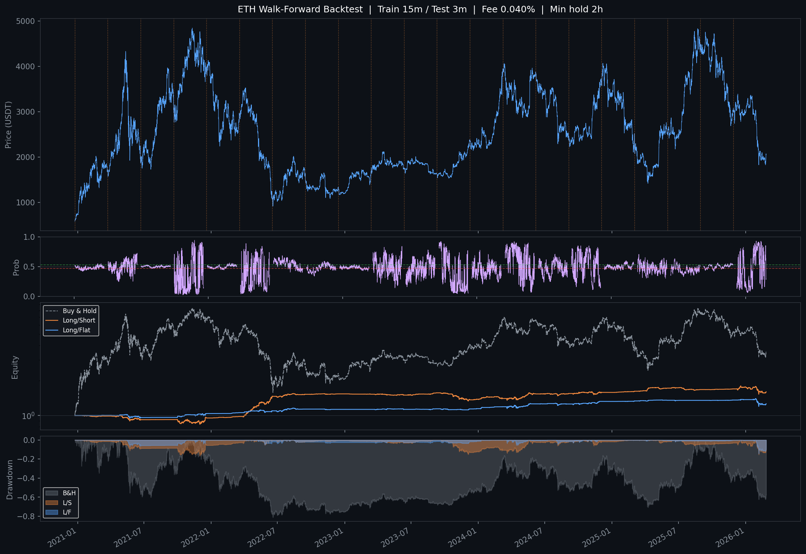
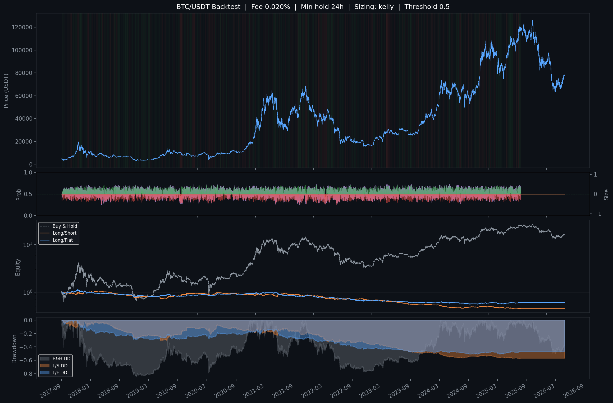

# ML Crypto Trading Bot

使用 **Transformer 深度學習模型** 預測加密貨幣 6 小時後價格方向，並在 Binance Futures（Demo 帳戶）自動執行多空交易。

支援 **BTC、ETH** 及任意 USDT 永續合約幣對訓練與部署。

---

## 專案架構

```
crypto-bot/
├── data.py               # 資料獲取、特徵工程、樣本加權（共用）
├── train.py              # 簡單訓練（單次 train/val 切分）
├── train_wf.py           # Walk-Forward 訓練（主要使用，支援任意幣對）
├── backtest.py           # 回測工具（配合 train.py 模型）
├── backtest_volatile.py  # 爆量追蹤策略回測
├── scan_coins.py         # 高波動幣種掃描器
├── monitor_coins.py      # 山寨幣監控 + 自動交易 Bot
├── main.py               # BTC/ETH ML Bot 主程式（Binance Demo）
├── Dockerfile            # 容器化部署
├── docker-compose.yml    # 同時啟動 BTC Bot + ETH Bot + 山寨幣監控
└── requirements.txt
```

---

## 模型架構

- **類型**：Pre-LN Transformer Encoder（二元分類）
- **輸入**：60 根 1h K 線的特徵序列（seq\_len = 60）
- **輸出**：6 小時後收盤價上漲機率（0–1）
- **損失函數**：Weighted BCE + Label Smoothing（0.1）
- **Pooling**：`(mean_pool + last_token) / 2`

### 超參數

| 參數 | 值 |
|---|---|
| d\_model | 128 |
| nhead | 8 |
| num\_layers | 3 |
| dropout | 0.2 |
| seq\_len | 60 |
| batch\_size | 256 |
| optimizer | AdamW (weight\_decay=1e-4) |
| LR schedule | Warmup + Cosine Annealing |

---

## 特徵集

### BTC：40 個特徵

| 類別 | 特徵數 | 說明 |
|---|---|---|
| 幣價動量 | 5 | returns, log\_returns, ret\_4h/8h/24h |
| 成交量 | 2 | volume\_change, volume\_ratio |
| 趨勢 | 3 | EMA9/21/50 ratio |
| 震盪指標 | 2 | RSI, MACD histogram |
| 波動度 | 5 | BB 位置/寬度, ATR, HL ratio, 已實現波動率 |
| K 線型態 | 3 | 實體比例, 上下影線 |
| 市場結構 | 1 | OBV（標準化） |
| 時間季節性 | 4 | 小時/星期幾的 sin/cos 編碼 |
| 美股市場 | 5 | SPY/QQQ/GLD 日報酬, VIX, 美股開盤時段 |
| 恐貪指數 | 2 | F&G 正規化值, 動能 |
| 資金費率 | 4 | 正規化, Z-score, 24h MA, 28d 累積 |
| 新聞情緒 | 2 | VADER 分數, 24h MA |
| 情緒趨勢相關 | 2 | 資金費率×趨勢相關, 新聞情緒×趨勢相關 |

### ETH：44 個特徵（40 + 4 個跨幣種特徵）

| 特徵 | 說明 |
|---|---|
| `eth_btc_ratio` | ETH/BTC 相對強弱（7d z-score） |
| `eth_btc_ratio_mom` | ETH/BTC 比值 24h 動量 |
| `btc_ret_1h` | BTC 1h 報酬（領先指標） |
| `btc_ret_4h` | BTC 4h 報酬 |

---

## 資料來源

| 資料 | 來源 |
|---|---|
| 1h K 線 | Binance（via ccxt，支援任意幣對） |
| 美股日收盤 | yfinance（SPY, QQQ, VIX, GLD） |
| 恐貪指數 | alternative.me API（免費） |
| 資金費率（8h） | Binance Futures API（via ccxt） |
| 加密貨幣新聞情緒 | CoinDesk / CoinTelegraph / Bitcoin Magazine / Decrypt RSS + VADER |

---

## Walk-Forward 訓練流程

`train_wf.py` 採用滾動視窗訓練，避免分布偏移與資料洩漏：

```
Window 1:  train 2019-10 ~ 2021-03  |  test 2021-04 ~ 2021-06
Window 2:  train 2020-01 ~ 2021-06  |  test 2021-07 ~ 2021-09
...
Window N:  train 2024-10 ~ 2026-01  |  test 2026-02 ~ 2026-04
```

- 每個視窗獨立訓練全新模型
- 以驗證集準確率做 Early Stopping（patience=10）
- 所有測試窗口預測拼接後統一做回測
- **最後一個視窗的模型**儲存為正式模型

### 訓練指令

```bash
# BTC（建議加 --balance_classes 改善做空）
python train_wf.py --balance_classes --threshold 0.53 --min_hold 24 --sizing half_kelly

# ETH（加 ETH/BTC 跨幣種特徵）
python train_wf.py --symbol ETH/USDT --since 2019-10-01 --train_months 15 --balance_classes --threshold 0.53 --sizing half_kelly

# 任意幣對 + 自訂模型大小
python train_wf.py --symbol SOL/USDT --d_model 64 --nhead 4 --n_layers 2 --seq_len 48

# 完整參數列表
python train_wf.py --help
```

### 訓練參數

| 參數 | 預設 | 說明 |
|---|---|---|
| `--symbol` | BTC/USDT | 訓練幣對 |
| `--train_months` | 18 | 每個視窗訓練月數 |
| `--threshold` | 0.50 | 進場信號閾值 |
| `--balance_classes` | 關 | 平衡上漲/下跌樣本數（改善做空） |
| `--min_move` | 0.0 | 最小波動門檻（過濾雜訊） |
| `--target_ahead` | 6 | 預測幾小時後的方向 |
| `--d_model` | 128 | Transformer 隱層大小 |
| `--n_layers` | 3 | Transformer 層數 |
| `--seq_len` | 60 | 輸入序列長度（根） |

---

## 回測結果

### ETH Walk-Forward（Out-of-Sample，含類別平衡）



| 策略 | 報酬 | Sharpe | 最大回撤 |
|---|---|---|---|
| Long/Short | +53.6% | 0.29 | -21.9% |
| Long/Flat | +11.8% | -0.13 | -22.7% |
| Buy & Hold | +224% | 0.27 | -81.3% |

### 全歷史回測（In-Sample）



> Walk-Forward 回測（OOS）才是真正的 out-of-sample 評估，全歷史回測存在 in-sample 偏差。

---

## Bot 說明

### ML Bot（`main.py`）

同一套程式碼透過環境變數支援任意幣對，每小時執行推論並自動交易。

| 設定 | 值 |
|---|---|
| 支援幣對 | BTC、ETH（環境變數 `SYMBOL` 切換） |
| 推論頻率 | 每小時 |
| 最小持倉時間 | 6h |
| 保證金比例 | 5%（`MAX_POS_PCT`） |
| 槓桿 | 20x 逐倉（`LEVERAGE`） |
| 止損 | 價格偏離 3%（`SL_PCT`） |
| 止盈 | 價格偏離 5%（`TP_PCT`） |
| 震盪翻倉 | 虧損超過 SL 一半且信號反轉 → 提前翻倉 |
| 最大回撤保護 | 回撤超過 20% 自動暫停（`MAX_DD_PCT`） |
| 帳戶模式 | Binance Demo（模擬交易） |

#### Telegram 通知

| 事件 | 說明 |
|---|---|
| 🟢 / 🔴 開倉 | 方向、數量、槓桿、止損/止盈價位 |
| 🔒 平倉 | 保證金盈虧（% 和 U） |
| ⚡ 止損/止盈觸發 | 預估盈虧 + 下一單方向 |
| ⚠️ 提前翻倉 | 震盪偵測觸發，翻倉原因 |
| 🚨 最大回撤 | 峰值/當前餘額、回撤% |
| 📋 每小時持倉 | 方向、盈虧、餘額 |
| 📈/📉 每日報告 | 日盈虧（U 和 %） |
| 💚 健康檢查 | 每 24h 確認 Bot 在線 |

### 山寨幣監控 Bot（`monitor_coins.py`）

每 15 分鐘掃描高波動幣種，偵測到 3 個以上信號自動開倉。每小時發送全市場漲跌幅榜。

| 設定 | 值 |
|---|---|
| 監控幣種 | 自動篩選前 20 名高波動 USDT 永續合約 |
| 掃描頻率 | 每 15 分鐘 |
| 每筆保證金 | $50 USDT |
| 槓桿 | 20x 逐倉 |
| 最大同時持倉 | 3 個 |
| 止損 | 10% |
| 追蹤止盈 | 從最佳價格回落 15% |
| 最長持倉 | 48 小時 |

#### 信號條件（4 選 3）
1. 成交量 ≥ 24h 均量的 1.5 倍
2. 近 4h 波動壓縮至均值 50% 以下
3. 距 14 日高點 ≤ 3%（突破訊號）
4. 資金費率劇變（±0.02%）

---

## 快速開始

### 1. 安裝依賴

```bash
pip install -r requirements.txt
# GPU 訓練（推薦）
pip install torch --index-url https://download.pytorch.org/whl/cu121
# CPU only
pip install torch --index-url https://download.pytorch.org/whl/cpu
```

### 2. 訓練模型

```bash
# BTC
python train_wf.py --balance_classes --threshold 0.53 --sizing half_kelly

# ETH（含 ETH/BTC 跨幣種特徵）
python train_wf.py --symbol ETH/USDT --since 2019-10-01 --train_months 15 --balance_classes --threshold 0.53 --sizing half_kelly
```

### 3. 回測

```bash
python backtest.py
python backtest.py --since 2022-01-01 --fee 0.0002
```

### 4. 雲端部署（VPS）

```bash
# 1. 安裝 Docker（Ubuntu）
curl -fsSL https://get.docker.com | sh && apt install docker-compose-plugin -y

# 2. Clone 專案
git clone https://github.com/AlexChen1028/TradingBot.git && cd TradingBot

# 3. 建立狀態檔
touch btc_bot.log eth_bot.log
printf '{"direction":0,"amount_coin":0.0,"entry_time":null,"entry_price":null,"sl_order_id":null,"tp_order_id":null,"peak_balance":null,"paused":false,"daily_open_balance":null,"daily_open_time":null,"last_heartbeat":null}' > btc_state.json
cp btc_state.json eth_state.json

# 4. 設定金鑰
cp .env.example .env && nano .env

# 5. 啟動（三個 Bot 同時跑，VPS 重開機自動恢復）
docker compose up -d --build
```

### 5. 常用指令

```bash
docker compose ps                          # 查看狀態
docker logs -f tradingbot-trading-bot-1    # BTC Bot log
docker logs -f tradingbot-eth-bot-1        # ETH Bot log
docker logs -f tradingbot-coin-monitor-1   # 山寨幣監控 log
git pull && docker compose up -d --build   # 更新程式碼
```

---

## 環境變數

### `.env` 必填

| 變數 | 說明 |
|---|---|
| `BINANCE_API_KEY` | Binance API Key |
| `BINANCE_SECRET_KEY` | Binance Secret Key |

### `.env` 選填（Telegram）

| 變數 | 說明 |
|---|---|
| `TELEGRAM_TOKEN` | BTC Bot 通知 Token |
| `TELEGRAM_CHAT_ID` | BTC Bot Chat ID |
| `MONITOR_TOKEN` | 山寨幣監控 Token |
| `MONITOR_CHAT_ID` | 山寨幣監控 Chat ID（可逗號分隔多個） |

### `docker-compose.yml` 可調參數

| 變數 | 預設 | 說明 |
|---|---|---|
| `SYMBOL` | BTC | 交易幣種（BTC / ETH） |
| `LONG_FLAT_ONLY` | false | 是否只做多 |
| `LEVERAGE` | 20 | 槓桿倍數 |
| `MAX_POS_PCT` | 0.05 | 保證金佔餘額比例 |
| `SL_PCT` | 0.03 | 止損距離（3%） |
| `TP_PCT` | 0.05 | 止盈距離（5%） |
| `MAX_DD_PCT` | 0.20 | 最大回撤保護閾值（20%） |

---

## 樣本加權機制

訓練時對「情緒極端」時期的樣本給予更高權重：

```
weight_i = 1 + 1.5 × sentiment_strength_i
sentiment_strength = (|fr_z| / 3 + |fng - 0.5| × 2 + |news_sent|) / 3
```

搭配 `--balance_classes` 可進一步平衡上漲/下跌樣本，改善模型做空準確率。

---

## 待辦事項

- [x] 交易通知（Telegram）
- [x] 止損/止盈（交易所掛單）
- [x] 20x 逐倉槓桿
- [x] 震盪偵測提前翻倉
- [x] 最大回撤保護
- [x] 每日績效報告
- [x] 健康檢查心跳
- [x] 多幣種支援（BTC、ETH）
- [x] ETH/BTC 跨幣種特徵
- [x] 類別平衡訓練（改善做空）
- [ ] 真實帳戶模式切換
- [ ] 每月自動重訓
- [ ] 績效儀表板（Grafana / HTML）
- [ ] 更多幣對（SOL 等）
