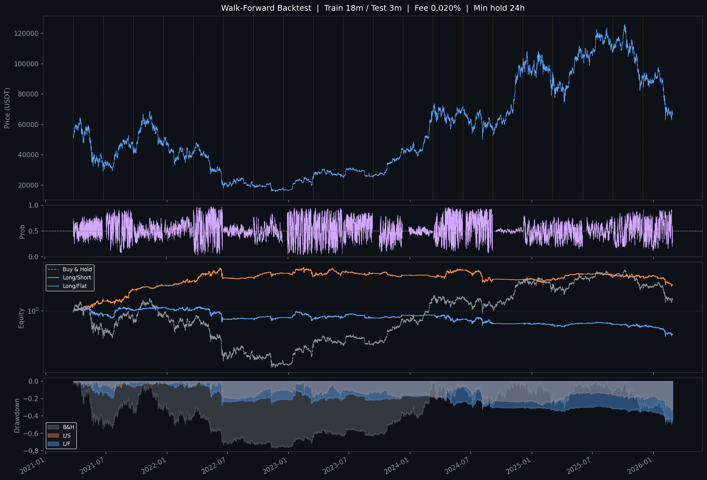

# BTC/USDT ML Trading Bot

使用 **Transformer 深度學習模型** 預測 BTC 6 小時後價格方向，並在 Binance Futures（Demo 帳戶）自動執行多空交易。

---

## 專案架構

```
crypto-bot/
├── data.py          # 資料獲取、特徵工程、樣本加權（共用）
├── train.py         # 簡單訓練（單次 train/val 切分）
├── train_wf.py      # Walk-Forward 訓練（主要使用）
├── backtest.py      # 回測工具（配合 train.py 模型）
├── main.py          # 實盤 Bot 主程式（Binance Demo）
├── Dockerfile       # 容器化部署
├── docker-compose.yml
└── requirements.txt
```

---

## 模型架構

- **類型**：Pre-LN Transformer Encoder（二元分類）
- **輸入**：60 根 1h K 線的特徵序列（seq\_len = 60）
- **輸出**：6 小時後收盤價上漲機率（0–1）
- **損失函數**：Weighted BCE + Label Smoothing（0.1）
- **Pooling**：`(mean_pool + last_token) / 2`

### 超參數

| 參數 | 值 |
|---|---|
| d\_model | 128 |
| nhead | 8 |
| num\_layers | 3 |
| dropout | 0.2 |
| seq\_len | 60 |
| batch\_size | 256 |
| optimizer | AdamW (weight\_decay=1e-4) |
| LR schedule | Warmup + Cosine Annealing |

---

## 特徵集（40 個）

| 類別 | 特徵數 | 說明 |
|---|---|---|
| BTC 動量 | 5 | returns, log\_returns, ret\_4h/8h/24h |
| 成交量 | 2 | volume\_change, volume\_ratio |
| 趨勢 | 3 | EMA9/21/50 ratio |
| 震盪指標 | 2 | RSI, MACD histogram |
| 波動度 | 5 | BB 位置/寬度, ATR, HL ratio, 已實現波動率 |
| K 線型態 | 3 | 實體比例, 上下影線 |
| 市場結構 | 1 | OBV（標準化） |
| 時間季節性 | 4 | 小時/星期幾的 sin/cos 編碼 |
| 美股市場 | 5 | SPY/QQQ/GLD 日報酬, VIX, 美股開盤時段 |
| 恐貪指數 | 2 | F&G 正規化值, 動能 |
| 資金費率 | 4 | 正規化, Z-score, 24h MA, 28d 累積 |
| 新聞情緒 | 2 | VADER 分數, 24h MA |
| 情緒趨勢相關 | 2 | 資金費率×趨勢相關, 新聞情緒×趨勢相關 |

---

## 資料來源

| 資料 | 來源 |
|---|---|
| BTC 1h K 線 | Binance（via ccxt） |
| 美股日收盤 | yfinance（SPY, QQQ, VIX, GLD） |
| 恐貪指數 | alternative.me API（免費） |
| 資金費率（8h） | Binance Futures API（via ccxt） |
| 加密貨幣新聞情緒 | CoinDesk / CoinTelegraph / Bitcoin Magazine / Decrypt RSS + VADER |

---

## Walk-Forward 訓練流程

`train_wf.py` 採用滾動視窗訓練，避免分布偏移與資料洩漏：

```
Window 1:  train 2019-10 ~ 2021-03  |  test 2021-04 ~ 2021-06
Window 2:  train 2020-01 ~ 2021-06  |  test 2021-07 ~ 2021-09
...
Window N:  train 2024-10 ~ 2026-01  |  test 2026-02 ~ 2026-04
```

- 每個視窗獨立訓練一個全新模型
- 以驗證集準確率做 Early Stopping（patience=10）
- 所有測試窗口的預測拼接後統一做回測
- **最後一個視窗的模型**儲存為正式模型（`btc_model_wf.pt`）

### 訓練指令

```bash
# 預設設定（train=18m, test=3m, step=3m）
python train_wf.py

# 自訂參數
python train_wf.py --train_months 12 --test_months 2 --fee 0.0002 --sizing half_kelly
```

---

## 回測結果

### Walk-Forward 回測（Out-of-Sample，2021–2026）



### 全歷史回測（In-Sample，2017–2026）


> **注意**：全歷史回測（`backtest.py`）使用的是同一批資料訓練出的模型，存在 in-sample 偏差。
> Walk-Forward 回測才是真正的 out-of-sample 評估。

### 回測設定

| 設定 | 值 |
|---|---|
| 手續費 | 0.020%（Maker） |
| 最小持倉時間 | 24h |
| 倉位計算 | Kelly（依模型信心動態調整） |
| 訊號閾值 | 0.50 |

---

## 交易策略（main.py）

| 設定 | 值 |
|---|---|
| 交易對 | BTC/USDT:USDT（USDT-M 永續合約） |
| 模型推論頻率 | 每小時 |
| 最小持倉時間 | 24h |
| 單次開倉比例 | 20% 可用 USDT |
| 訊號閾值 | P > 0.50 → 做多，P < 0.50 → 做空 |
| 訂單類型 | 市價單 |
| 停損 | 虧損 ≥ 5% 強制平倉 |
| 帳戶模式 | **Binance Demo（模擬交易）** |

---

## 快速開始

### 1. 安裝依賴

```bash
pip install -r requirements.txt
# PyTorch 需另行安裝（配合 CUDA 版本）：
# https://pytorch.org/get-started/locally/
pip install torch torchvision torchaudio --index-url https://download.pytorch.org/whl/cu121
```

### 2. 訓練模型

```bash
# Walk-Forward 訓練（推薦）
python train_wf.py

# 或簡單訓練
python train.py
```

### 3. 回測

```bash
python backtest.py
python backtest.py --since 2022-01-01 --fee 0.0002
```

### 4. 啟動 Bot

```bash
# 設定 API 金鑰（Binance Demo 帳戶）
set BINANCE_API_KEY=your_key
set BINANCE_SECRET_KEY=your_secret

python main.py
```

### 5. Docker 部署

```bash
# 建立 .env 檔案
echo BINANCE_API_KEY=your_key > .env
echo BINANCE_SECRET_KEY=your_secret >> .env

docker-compose up -d
```

---

## 環境變數

| 變數 | 說明 |
|---|---|
| `BINANCE_API_KEY` | Binance API Key |
| `BINANCE_SECRET_KEY` | Binance Secret Key |
| `TELEGRAM_TOKEN` | Telegram Bot Token（選填，不填則不發通知） |
| `TELEGRAM_CHAT_ID` | Telegram Chat ID（選填） |

---

## 樣本加權機制

訓練時對「情緒極端」時期的樣本給予更高權重，讓模型在關鍵行情前後學得更仔細：

```
weight_i = 1 + 1.5 × sentiment_strength_i

sentiment_strength = (|fr_z| / 3 + |fng - 0.5| × 2 + |news_sent|) / 3
```

- 資金費率 Z-score 極端 → 市場過度槓桿，反轉訊號
- 恐貪指數極端 → 情緒頂底
- 新聞情緒極端 → 媒體熱度拐點

---

## 待辦事項

### 緊急（功能性缺陷）

- [x] **修復 `requirements.txt`**：補上 `yfinance`、`feedparser`、`vaderSentiment`、`requests`
- [x] **修復 Dockerfile**：加入 PyTorch 安裝指令（CPU build；需 GPU 請換 CUDA index URL）
- [x] **修復 `docker-compose.yml`**：加入 `volumes` 掛載，避免容器重啟後遺失模型檔、`bot_state.json`、`bot.log`
- [x] **新增 `.env.example`**：讓新使用者知道需要哪些環境變數

### 功能強化

- [ ] **自動定期重訓**：每月用最新資料重跑 `train_wf.py`，更新線上模型
- [x] **交易通知**：開倉/平倉/異常時發送 Telegram 訊息（設定 `TELEGRAM_TOKEN` + `TELEGRAM_CHAT_ID` 即啟用）
- [x] **停損機制**：虧損超過 `STOP_LOSS_PCT`（預設 5%）時強制平倉，並發送 Telegram 警報
- [ ] **最大回撤保護**：組合虧損超過閾值時暫停交易
- [ ] **真實帳戶模式**：新增設定項切換 Demo / Live
- [ ] **多幣種支援**：擴展至 ETH、SOL 等其他幣對

### 監控與可觀測性

- [ ] **績效儀表板**：Grafana 或簡易 HTML 頁面，顯示每日 PnL、持倉狀況、模型信心
- [ ] **健康檢查**：Bot 異常中斷時自動發送警報
- [ ] **交易日誌結構化**：將 `bot.log` 改為 JSON 格式，方便後續分析

### 研究方向

- [ ] **更長預測視窗**：嘗試 12h / 24h 目標，減少交易頻率、降低手續費侵蝕
- [ ] **Regime 偵測**：加入牛熊市場狀態特徵，讓模型在不同市況下有不同行為
- [ ] **特徵重要性分析**：用 SHAP 分析哪些特徵對模型貢獻最大
- [ ] **超參數搜尋**：Optuna 自動調整 d\_model、nhead、seq\_len 等
