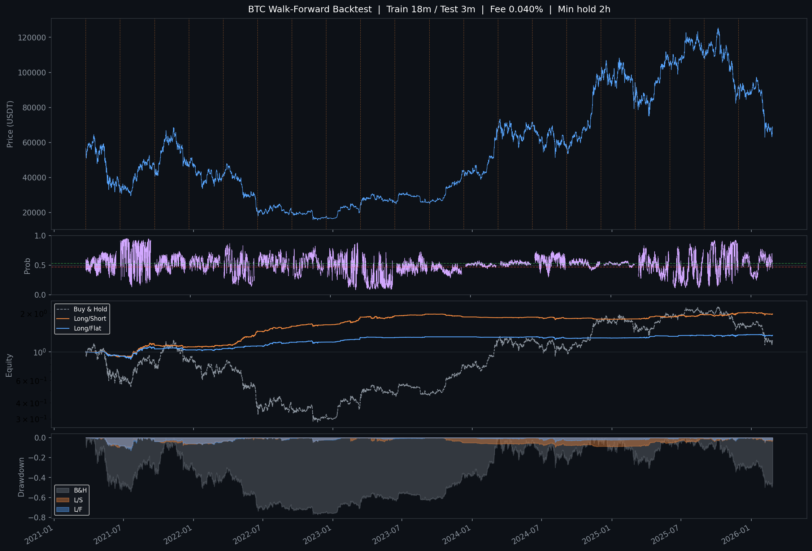

# ML Crypto Trading Bot

使用 **Transformer 深度學習模型** 預測加密貨幣 6 小時後價格方向，並在 Binance Futures（Demo 帳戶）自動執行多空交易。

支援 **BTC、ETH** 及任意 USDT 永續合約幣對訓練與部署。

---

## 專案架構

```
crypto-bot/
├── data.py               # 資料獲取、特徵工程、樣本加權（共用）
├── train.py              # 簡單訓練（單次 train/val 切分）
├── train_wf.py           # Walk-Forward 訓練（主要使用，支援任意幣對）
├── backtest.py           # 回測工具（配合 train.py 模型）
├── backtest_volatile.py  # 爆量追蹤策略回測
├── scan_coins.py         # 高波動幣種掃描器
├── monitor_coins.py      # 山寨幣監控 + 自動交易 Bot
├── main.py               # BTC/ETH ML Bot 主程式（Binance Demo）
├── Dockerfile            # 容器化部署
├── docker-compose.yml    # 同時啟動 ML Bot + 山寨幣監控
└── requirements.txt
```

---

## 模型架構

- **類型**：Pre-LN Transformer Encoder（二元分類）
- **輸入**：60 根 1h K 線的特徵序列（seq\_len = 60）
- **輸出**：6 小時後收盤價上漲機率（0–1）
- **損失函數**：Weighted BCE + Label Smoothing（0.1）
- **Pooling**：`(mean_pool + last_token) / 2`

### 超參數

| 參數 | 值 |
|---|---|
| d\_model | 128 |
| nhead | 8 |
| num\_layers | 3 |
| dropout | 0.2 |
| seq\_len | 60 |
| batch\_size | 256 |
| optimizer | AdamW (weight\_decay=1e-4) |
| LR schedule | Warmup + Cosine Annealing |

---

## 特徵集（40 個）

| 類別 | 特徵數 | 說明 |
|---|---|---|
| 幣價動量 | 5 | returns, log\_returns, ret\_4h/8h/24h |
| 成交量 | 2 | volume\_change, volume\_ratio |
| 趨勢 | 3 | EMA9/21/50 ratio |
| 震盪指標 | 2 | RSI, MACD histogram |
| 波動度 | 5 | BB 位置/寬度, ATR, HL ratio, 已實現波動率 |
| K 線型態 | 3 | 實體比例, 上下影線 |
| 市場結構 | 1 | OBV（標準化） |
| 時間季節性 | 4 | 小時/星期幾的 sin/cos 編碼 |
| 美股市場 | 5 | SPY/QQQ/GLD 日報酬, VIX, 美股開盤時段 |
| 恐貪指數 | 2 | F&G 正規化值, 動能 |
| 資金費率 | 4 | 正規化, Z-score, 24h MA, 28d 累積 |
| 新聞情緒 | 2 | VADER 分數, 24h MA |
| 情緒趨勢相關 | 2 | 資金費率×趨勢相關, 新聞情緒×趨勢相關 |

---

## 資料來源

| 資料 | 來源 |
|---|---|
| 1h K 線 | Binance（via ccxt，支援任意幣對） |
| 美股日收盤 | yfinance（SPY, QQQ, VIX, GLD） |
| 恐貪指數 | alternative.me API（免費） |
| 資金費率（8h） | Binance Futures API（via ccxt） |
| 加密貨幣新聞情緒 | CoinDesk / CoinTelegraph / Bitcoin Magazine / Decrypt RSS + VADER |

---

## Walk-Forward 訓練流程

`train_wf.py` 採用滾動視窗訓練，避免分布偏移與資料洩漏：

```
Window 1:  train 2019-10 ~ 2021-03  |  test 2021-04 ~ 2021-06
Window 2:  train 2020-01 ~ 2021-06  |  test 2021-07 ~ 2021-09
...
Window N:  train 2024-10 ~ 2026-01  |  test 2026-02 ~ 2026-04
```

- 每個視窗獨立訓練一個全新模型
- 以驗證集準確率做 Early Stopping（patience=10）
- 所有測試窗口的預測拼接後統一做回測
- **最後一個視窗的模型**儲存為正式模型

### 訓練指令

```bash
# BTC（預設）
python train_wf.py

# ETH
python train_wf.py --symbol ETH/USDT --since 2019-10-01

# 任意幣對 + 自訂參數
python train_wf.py --symbol SOL/USDT --train_months 12 --test_months 2 --fee 0.0002 --sizing half_kelly
```

訓練完成後自動產生（以 ETH 為例）：
- `eth_model_wf.pt` — 模型權重
- `eth_scaler_wf.pkl` — 特徵標準化器
- `eth_backtest_wf.png` — 回測圖表

---

## 回測結果

### BTC Walk-Forward 回測（Out-of-Sample）



### 全歷史回測（In-Sample）


> **注意**：全歷史回測（`backtest.py`）使用的是同一批資料訓練出的模型，存在 in-sample 偏差。
> Walk-Forward 回測才是真正的 out-of-sample 評估。

### 回測設定

| 設定 | 值 |
|---|---|
| 手續費 | 0.020%（Maker） |
| 最小持倉時間 | 24h |
| 倉位計算 | Kelly（依模型信心動態調整） |
| 訊號閾值 | 0.50 |

---

## Bot 說明

### ML Bot（`main.py`）

使用 Walk-Forward 模型預測幣價方向，自動執行 Binance Futures 多空交易。

| 設定 | 值 |
|---|---|
| 交易對 | BTC/USDT:USDT（可改為 ETH） |
| 模型推論頻率 | 每小時 |
| 最小持倉時間 | 6h |
| 單次開倉比例 | 20% 可用 USDT |
| 訊號閾值 | P > 0.50 → 做多，P < 0.50 → 做空 |
| 訂單類型 | 市價單 |
| 停損 | 虧損 ≥ 5% 強制平倉 |
| 帳戶模式 | Binance Demo（模擬交易） |

### 山寨幣監控 Bot（`monitor_coins.py`）

每 15 分鐘掃描高波動幣種，偵測到 3 個以上信號自動開倉。每小時發送 Binance 全市場漲跌幅榜到 Telegram。

| 設定 | 值 |
|---|---|
| 監控幣種 | 自動篩選前 20 名高波動 USDT 永續合約 |
| 掃描頻率 | 每 15 分鐘 |
| 每筆保證金 | $50 USDT |
| 槓桿 | 20x |
| 最大同時持倉 | 3 個 |
| 止損 | 10% |
| 追蹤止盈 | 從最佳價格回落 15% |
| 最長持倉 | 48 小時 |

#### 信號條件（4 選 3）
1. 成交量 ≥ 24h 均量的 1.5 倍
2. 近 4h 波動壓縮至均值 50% 以下
3. 距 14 日高點 ≤ 3%（突破訊號）
4. 資金費率劇變（±0.02%）

---

## 快速開始

### 1. 安裝依賴

```bash
pip install -r requirements.txt
pip install torch --index-url https://download.pytorch.org/whl/cpu
```

### 2. 訓練模型

```bash
# BTC
python train_wf.py

# ETH
python train_wf.py --symbol ETH/USDT --since 2019-10-01
```

### 3. 回測

```bash
python backtest.py
python backtest.py --since 2022-01-01 --fee 0.0002
```

### 4. 本機啟動

```bash
cp .env.example .env
# 填入 API 金鑰後：
python main.py          # ML Bot
python monitor_coins.py # 山寨幣監控
```

### 5. Docker 本機啟動

```bash
cp .env.example .env
# 填入金鑰後：
docker compose up -d --build
```

---

## 雲端部署（VPS）

### 環境需求
- Ubuntu 24.04
- Docker + Docker Compose Plugin

### 部署步驟

```bash
# 1. 安裝 Docker
curl -fsSL https://get.docker.com | sh
apt install docker-compose-plugin -y

# 2. Clone 專案
git clone https://github.com/AlexChen1028/TradingBot.git
cd TradingBot

# 3. 設定金鑰
cp .env.example .env
nano .env

# 4. 啟動（自動重啟，VPS 重開機後也會自動恢復）
docker compose up -d --build
```

### 常用指令

```bash
# 查看狀態
docker compose ps

# 查看 ML Bot log
docker logs -f tradingbot-trading-bot-1

# 查看山寨幣監控 log
docker logs -f tradingbot-coin-monitor-1

# 更新程式碼
git pull && docker compose up -d --build
```

---

## 環境變數

| 變數 | 說明 |
|---|---|
| `BINANCE_API_KEY` | Binance API Key |
| `BINANCE_SECRET_KEY` | Binance Secret Key |
| `TELEGRAM_TOKEN` | ML Bot 的 Telegram Token（選填） |
| `TELEGRAM_CHAT_ID` | ML Bot 通知的 Chat ID（選填） |
| `MONITOR_TOKEN` | 山寨幣監控的 Telegram Token（選填） |
| `MONITOR_CHAT_ID` | 山寨幣監控通知的 Chat ID，可填多個用逗號分隔（選填） |

---

## 樣本加權機制

訓練時對「情緒極端」時期的樣本給予更高權重：

```
weight_i = 1 + 1.5 × sentiment_strength_i

sentiment_strength = (|fr_z| / 3 + |fng - 0.5| × 2 + |news_sent|) / 3
```

- 資金費率 Z-score 極端 → 市場過度槓桿，反轉訊號
- 恐貪指數極端 → 情緒頂底
- 新聞情緒極端 → 媒體熱度拐點

---

## 待辦事項

### 功能強化

- [x] 交易通知（Telegram）
- [x] 停損機制（虧損 ≥ 5% 強制平倉）
- [x] 山寨幣監控 + 自動交易
- [x] 多幣種訓練支援（ETH、SOL 等）
- [ ] ETH Bot 整合進 `main.py`
- [ ] 最大回撤保護
- [ ] 真實帳戶模式切換
- [ ] 自動定期重訓

### 監控與可觀測性

- [ ] 績效儀表板（Grafana 或簡易 HTML）
- [ ] 健康檢查（Bot 異常時自動警報）
- [ ] 交易日誌結構化（JSON 格式）

### 研究方向

- [ ] 更長預測視窗（12h / 24h）
- [ ] Regime 偵測（牛熊市場狀態特徵）
- [ ] 超參數搜尋（Optuna）
